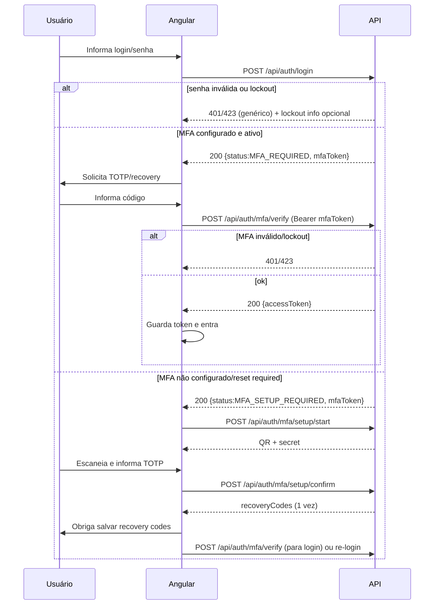

# Plano — MFA obrigatório com TOTP (RFC 6238)

Pasta alvo: `Documents/Login_and_Token`

## Objetivo
Implementar **MFA obrigatório para todos os usuários humanos**, usando **TOTP (RFC 6238)** compatível com:

- Google Authenticator
- Microsoft Authenticator
- FortiToken Mobile
- Authy
- Bitwarden
- 1Password
- Qualquer app TOTP

Requisitos chave:

1. Login inicia com **usuário/senha**.
2. Se MFA **não configurado**, sistema **obriga configuração** antes de liberar acesso.
3. Após ativado, **exigir MFA em todos os logins**.
4. **Admin** consegue **resetar MFA** de qualquer usuário.
5. Após reset, usuário é **obrigado** a configurar novamente.
6. Suporte a **Recovery Codes**.
7. Proteção contra **brute force** (senha e MFA) + **lockout temporário configurável**.
8. **Auditoria** completa de eventos de MFA.

## Contexto atual (levantado)
- Backend: `.NET 8`, Minimal APIs, Vertical Slice (ex.: `Partner.Api/Features/Auth/AuthEndpoints.cs`).
- Banco: SQL Server, acesso via Dapper.
- Auth atual: `POST /api/auth/login` emite JWT direto quando login/senha ok.
- Frontend: Angular, tela simples de login (`features/auth/login`).

## Decisões funcionais e de segurança (confirmadas)
1. **MFA obrigatório imediatamente** para todos usuários humanos (inclui Admin).
2. **Recovery codes**:
   - gerar **10**;
   - formato: `XXXX-XXXX-XXXX`;
   - exibir **apenas uma vez**;
   - armazenar **somente hash**;
   - ao usar 1 recovery code: **invalidar todos os demais** e **obrigar gerar novo conjunto**.
3. **Reset por Admin**:
   - apagar secret;
   - invalidar recovery codes;
   - marcar como “não configurado / reset required”;
   - **não** invalidar sessões já emitidas nesta versão (JWT expira normalmente).
4. **Login em 2 etapas**:
   - etapa 1 valida login/senha e retorna estado (`MFA_REQUIRED` / `MFA_SETUP_REQUIRED` / `LOGIN_SUCCESS`)
   - etapa 2 valida TOTP/recovery e **só então** emite JWT definitivo

---

# 1) Modelo de Banco de Dados

## 1.1. Decisão adotada: tabela 1:1 `tb_usuario_mfa`
Decisão: **adotar tabela 1:1** para MFA e deixar `tb_usuario` sem colunas de MFA.

Motivo: isola preocupação de segurança, reduz impacto em legado, e facilita evolução (WebAuthn, múltiplos fatores, etc.).

### Tabela: `tb_usuario_mfa` (1:1)
**Chave:** `UserId` é PK e FK para `tb_usuario(Id)`.

Campos (espelha os campos sugeridos no requisito original, porém isolados):

- `UserId INT NOT NULL PRIMARY KEY` (FK)
- `MfaEnabled BIT NOT NULL DEFAULT(0)`
- `MfaSecret VARBINARY(512) NULL` *(armazenar criptografado; ver seção 1.4; tamanho maior para suportar envelope/metadata do algoritmo no futuro)*
- `MfaSetupStartedAt DATETIME NULL` *(quando o setup foi iniciado; útil para expiração/limpeza de segredos pendentes e auditoria)*
- `MfaConfiguredAt DATETIME NULL`
- `RecoveryCodesGeneratedAt DATETIME NULL` *(data do último lote de recovery codes gerado)*
- `MfaResetRequired BIT NOT NULL DEFAULT(0)`

- `FailedPasswordAttempts INT NOT NULL DEFAULT(0)`
- `PasswordLockoutUntil DATETIME NULL`

- `FailedMfaAttempts INT NOT NULL DEFAULT(0)`
- `MfaLockoutUntil DATETIME NULL`

- `LastSuccessfulMfaAt DATETIME NULL` *(opcional, útil para auditoria e detecção)*
- `CreatedAt DATETIME NOT NULL DEFAULT(GETDATE())`
- `UpdatedAt DATETIME NULL`

Índices sugeridos:
- `IX_tb_usuario_mfa_PasswordLockoutUntil (PasswordLockoutUntil)`
- `IX_tb_usuario_mfa_MfaLockoutUntil (MfaLockoutUntil)`

> Observação: o SQL inicialmente sugerido com `ALTER TABLE tb_usuario ADD ...` **não será adotado** nesta fase (mantido apenas como referência histórica).

### Tabela: `tb_usuario_mfa_recovery`
Manter muito próximo do que foi pedido, com 2 ajustes:
- guardar também `CodeId` (id lógico) para rastreio;
- suportar “invalidate all” por lote.

Campos:
- `Id INT IDENTITY(1,1) PRIMARY KEY`
- `UserId INT NOT NULL` (FK `tb_usuario(Id)`)
- `CodeId UNIQUEIDENTIFIER NOT NULL` *(id público opcional)*
- `CodeHash VARCHAR(500) NOT NULL`
- `Used BIT NOT NULL DEFAULT(0)`
- `UsedAt DATETIME NULL`
- `Invalidated BIT NOT NULL DEFAULT(0)` *(para invalidar lote)*
- `InvalidatedAt DATETIME NULL`
- `CreatedAt DATETIME NOT NULL DEFAULT(GETDATE())`

Índices:
- `IX_tb_usuario_mfa_recovery_UserId_Used (UserId, Used)`

### Tabela: `tb_audit_log`
Você já propôs:

```
CREATE TABLE tb_audit_log
(
    Id BIGINT IDENTITY(1,1) PRIMARY KEY,
    UserId INT NULL,
    EventType VARCHAR(100) NOT NULL,
    EventDescription VARCHAR(500) NULL,
    CorrelationId VARCHAR(100) NULL,
    CreatedAt DATETIME NOT NULL DEFAULT(GETDATE())
);
```

Recomendação: evoluir minimamente (sem quebrar) com campos adicionais **não obrigatórios**:
- `ActorUserId INT NULL` *(quem executou a ação; em login, pode ser igual a UserId)*
- `IpAddress VARCHAR(45) NULL` *(IPv4/IPv6)*
- `UserAgent VARCHAR(300) NULL`
- `MetadataJson NVARCHAR(MAX) NULL` *(detalhes do evento: login, motivo lockout, etc.)*

> Se não for possível agora, manter a versão atual e registrar o essencial no `EventDescription`.

## 1.2. Alternativa (NÃO adotada nesta fase): colunas direto na `tb_usuario`
Esta alternativa **fica fora do escopo** da decisão atual. O motivo é reduzir impacto em schema legado e manter MFA isolado.

Se em algum momento ela for necessária, o restante do plano permanece conceitualmente igual, porém:
- as queries passam a ler/escrever `tb_usuario` diretamente;
- aumenta risco operacional e de migração.

## 1.3. Alterações em `tb_usuario`
Com a tabela 1:1 `tb_usuario_mfa`, **não é necessário alterar `tb_usuario`** para MFA.

Mudança opcional (futura): flag para contas técnicas que poderão ser dispensadas:
- `IsServiceAccount BIT NOT NULL DEFAULT(0)` *(fora de escopo nesta fase — ver seção “NÃO implementar”)*

## 1.4. Política de armazenamento do Secret TOTP
**Nunca** armazenar o secret em claro.

Recomendado:
- armazenar `MfaSecret` criptografado (ex.: AES-GCM) com uma chave mestra protegida por:
  - Secret manager/KeyVault (ideal), ou
  - variável de ambiente (mínimo)

Alternativas viáveis no Windows:
- DPAPI (escopo máquina/usuário) — bom para on-prem, mas complica scale-out.

Formato de secret:
- gerar 20 bytes (160 bits) aleatórios, depois representar como Base32 para o `otpauth://`.
- parâmetros TOTP: `period=30`, `digits=6`, `algorithm=SHA1` (compatível por padrão com a maioria dos apps).

---

# 2) Endpoints Backend (Vertical Slice)

## 2.1. Princípios
- **Não emitir JWT** enquanto MFA não for validado (quando aplicável).
- Respostas não devem permitir **enumeração de usuários** (mensagens genéricas).
- Brute force controlado por:
  - contadores por usuário no banco (senha e MFA)
  - opcionalmente, rate limiting por IP (fora de escopo nesta fase)

## 2.2. Contratos e endpoints propostos

### 2.2.1. Etapa 1 — Login com senha
`POST /api/auth/login`

Request:
```json
{ "login": "string", "password": "string" }
```

Response (200):
```json
{
  "status": "LOGIN_SUCCESS" | "MFA_REQUIRED" | "MFA_SETUP_REQUIRED",
  "accessToken": "string | null",
  "expiresAtUtc": "2026-01-01T00:00:00Z | null",
  "name": "string",
  "mfaToken": "string | null",
  "mfaLockoutUntilUtc": "... | null",
  "passwordLockoutUntilUtc": "... | null"
}
```

Regras:
- se usuário/senha inválidos: 401 genérico; incrementar `FailedPasswordAttempts`; aplicar lockout.
- se senha ok e MFA configurado/ativo: **retornar `MFA_REQUIRED` + `mfaToken`** (token temporário de 5 min).
- se senha ok e MFA não configurado ou reset required: **`MFA_SETUP_REQUIRED` + `mfaToken`**.

> `mfaToken` não é JWT de acesso. É um token temporário (ex.: random + hash no banco, ou JWT curto com claim “mfa_pending”) usado somente para concluir a etapa 2.

## 2.3. Estratégia segura para armazenamento do `mfaToken` (etapa 2)

Recomendação: **token opaco aleatório + persistência apenas do hash** (nunca o token em claro) com expiração curta.

### 2.3.1. Por que não JWT para `mfaToken`?
- JWT curto seria viável, mas:
  - dá mais superfície (validação, rotação, vazamento em logs),
  - dificulta “uso único” sem estado.

### 2.3.2. Modelo recomendado (stateful)
Criar tabela `tb_auth_mfa_pending` para armazenar o estado do login pendente de MFA:

- `Id UNIQUEIDENTIFIER NOT NULL PRIMARY KEY` *(id do desafio; pode ser a parte pública do token)*
- `UserId INT NOT NULL` (FK)
- `TokenHash VARBINARY(64) NOT NULL` *(ex.: HMACSHA256 do token opaco)*
- `ExpiresAt DATETIME NOT NULL`
- `ConsumedAt DATETIME NULL` *(uso único)*
- `CreatedAt DATETIME NOT NULL DEFAULT(GETDATE())`
- `IpAddress VARCHAR(45) NULL`
- `UserAgentHash VARBINARY(32) NULL` *(opcional; reduz replay)*

Formato do token enviado ao cliente:
- `mfaToken = base64url( Id + "." + randomSecret )`

Validação:
1) parseia Id e randomSecret
2) recalcula hash e compara com `TokenHash` (constant-time compare)
3) valida `ExpiresAt` e `ConsumedAt is null`
4) marca `ConsumedAt=now` em sucesso (para evitar replay)

Limpeza:
- job simples (ou no próprio fluxo) removendo expirados.

> Observação: esta tabela é pequena, de alta rotatividade e não armazena dado sensível em claro.

### 2.2.2. Etapa 2 — Verificar MFA para concluir login
`POST /api/auth/mfa/verify`

Headers:
- `Authorization: Bearer {mfaToken}` *(ou header específico `X-MFA-Token`)*

Request (um dos dois):
```json
{ "totpCode": "123456" }
```
ou
```json
{ "recoveryCode": "ABCD-EFGH-IJKL" }
```

Response (200):
```json
{ "accessToken": "...", "expiresAtUtc": "...", "name": "..." }
```

Regras:
- se TOTP inválido: incrementar `FailedMfaAttempts` e eventualmente `MfaLockoutUntil`.
- se recovery code usado com sucesso:
  - marcar `Used=1`, `UsedAt=...`;
  - invalidar os demais códigos do usuário;
  - retornar `MFA_SETUP_REQUIRED` (ou um `NEXT_STEP=REGENERATE_RECOVERY_CODES`) para forçar regeneração.

### 2.2.3. Setup MFA — iniciar (gerar secret + QR)
`POST /api/auth/mfa/setup/start`

Headers: `Authorization: Bearer {mfaToken}`

Response (200):
```json
{
  "totpSecret": "BASE32...", 
  "otpauthUri": "otpauth://totp/...",
  "qrCodePngBase64": "..."
}
```

Regras:
- gerar secret novo e armazenar como **pendente** (ex.: em `tb_usuario_mfa` com `MfaEnabled=0`).
- incluir `issuer` e `accountName` no `otpauthUri`.

### 2.2.4. Setup MFA — confirmar e habilitar
`POST /api/auth/mfa/setup/confirm`

Headers: `Authorization: Bearer {mfaToken}`

Request:
```json
{ "totpCode": "123456" }
```

Response (200):
```json
{
  "recoveryCodes": ["XXXX-XXXX-XXXX", "..."]
}
```

Regras:
- validar TOTP com uma tolerância pequena (ex.: janela -1/+1 step) para clock skew.
- ao confirmar:
  - `MfaEnabled=1`, `MfaConfiguredAt=now`, `MfaResetRequired=0`;
  - gerar 10 recovery codes, persistir somente hash;
  - auditar `MFA_ENABLED`.
- recovery codes **somente exibidos uma vez**.

### 2.2.5. Recovery — regenerar conjunto (após uso de um)
`POST /api/auth/mfa/recovery/regenerate`

Auth: JWT normal (usuário já autenticado) **e** exigir MFA recente opcionalmente (fora de escopo agora).

Response:
```json
{ "recoveryCodes": ["..."] }
```

Regras:
- invalidar todos anteriores;
- gerar novo conjunto;
- auditar `RECOVERY_CODES_REGENERATED` (evento novo) ou reutilizar `MFA_ENABLED` com descrição.

### 2.2.6. Admin — reset MFA de um usuário
`POST /api/users/{id:int}/mfa/reset`

AuthZ:
- policy Admin (ou permissão específica futura).

Efeito:
- zerar/invalidar secret e recovery;
- `MfaEnabled=0`, `MfaResetRequired=1`, `MfaConfiguredAt=NULL`;
- auditar `MFA_RESET`.

### 2.2.7. Admin — desbloqueio (senha e/ou MFA)
`POST /api/users/{id:int}/unlock`

Efeito:
- `FailedPasswordAttempts=0`, `PasswordLockoutUntil=NULL`
- `FailedMfaAttempts=0`, `MfaLockoutUntil=NULL`
- auditar `USER_UNLOCKED`

---

# 3) Telas/UX Angular (proposta)

## 3.1. Tela 1 — Login (existente, ajustada)
`/login`

Mudanças:
- ao submeter login/senha:
  - se `LOGIN_SUCCESS`: armazenar JWT como hoje e navegar `/`;
  - se `MFA_REQUIRED`: navegar para `/mfa` (passando `mfaToken`); 
  - se `MFA_SETUP_REQUIRED`: navegar para `/mfa/setup`.

## 3.2. Tela 2 — Desafio MFA
`/mfa`

Componentes:
- campo código (6 dígitos)
- alternativa “usar recovery code” (input texto)
- botão “verificar”
- mensagens genéricas de erro + feedback de lockout (se houver)

## 3.3. Tela 3 — Setup MFA obrigatório (wizard)
`/mfa/setup`

Passos:
1) “Configurar autenticador”
   - renderizar QR code
   - exibir secret (copiar)
2) “Confirmar código”
   - input TOTP (6 dígitos)
3) “Salvar recovery codes”
   - listar 10 códigos
   - CTA “Eu salvei” (obrigatório)

## 3.4. Tela 4 — Gestão de usuários (Admin)
Em `features/users` (existente) adicionar ações:
- “Resetar MFA” (confirm dialog)
- “Desbloquear usuário” (se lockout)

---

# 4) Fluxo completo de login (end-to-end)



Nota: após `setup/confirm`, dá para:
- **opção A:** já retornar `mfaToken` válido e redirecionar para `/mfa` para concluir emissão do JWT,
- **opção B (mais simples):** forçar o usuário a repetir `POST /login` e então `verify`.

---

# 5) Estratégia de lockout (senha e MFA)

## 5.1. Parâmetros sugeridos (configuráveis)
Em `appsettings` (ex.: seção `Security:Mfa`):
- `PasswordMaxAttempts` (ex.: 5)
- `PasswordLockoutMinutes` (ex.: 15)
- `MfaMaxAttempts` (ex.: 5)
- `MfaLockoutMinutes` (ex.: 15)
- `MfaPendingTokenMinutes` (ex.: 5)

## 5.2. Regras
- Em falha de senha:
  - incrementa `FailedPasswordAttempts`;
  - ao atingir limite: seta `PasswordLockoutUntil = now + N`.
- Em sucesso de senha:
  - zera `FailedPasswordAttempts`.
- Em falha de MFA:
  - incrementa `FailedMfaAttempts`;
  - ao atingir limite: seta `MfaLockoutUntil = now + N`.
- Em sucesso de MFA:
  - zera `FailedMfaAttempts`.

Recomendação de status HTTP:
- `401 Unauthorized` para credencial inválida (genérico)
- `423 Locked` para lockout (se quiser diferenciar), ou `403` com body padronizado

---

# 6) Estratégia de auditoria

## 6.1. Eventos (baseline)
Eventos fornecidos:
- `MFA_ENABLED`
- `MFA_RESET`
- `MFA_DISABLED` *(não usar nesta fase, mas pode existir para futuro)*
- `MFA_FAILED`
- `MFA_LOCKED`
- `USER_UNLOCKED`
- `RECOVERY_CODE_USED`

Eventos adicionais recomendados (opcionais):
- `MFA_SETUP_STARTED`
- `RECOVERY_CODES_REGENERATED`

## 6.2. Quando registrar
- `MFA_SETUP_STARTED`: ao gerar secret/QR.
- `MFA_ENABLED`: ao confirmar setup.
- `MFA_FAILED`: a cada tentativa inválida de MFA (cuidado com volume; alternativa: somente quando atingir limiar ou agregar).
- `MFA_LOCKED`: quando aplica lockout de MFA.
- `RECOVERY_CODE_USED`: quando recovery code válido.
- `MFA_RESET`: reset por admin.
- `USER_UNLOCKED`: unlock por admin.

## 6.3. CorrelationId
Reutilizar o `CorrelationId` já usado em observabilidade para encadear:
- login (etapa 1)
- verify (etapa 2)
- setup/start e setup/confirm

---

# 7) Riscos de segurança e mitigação

1) **Secret TOTP em claro**
   - Mitigar: criptografia forte em repouso (`VARBINARY` + AES-GCM) + chave fora do código.

2) **Exposição do QR code/secret no frontend**
   - Mitigar: exibir apenas durante setup, nunca logar/telemetria com secret, impedir cache (headers).

3) **Enumerar usuários (login indica se existe)**
   - Mitigar: respostas genéricas, tempos semelhantes, não revelar “usuário existe”.

4) **Brute force por senha/MFA**
   - Mitigar: lockout (por usuário) + futuramente rate limiting por IP e device fingerprint.

5) **Ataques com relógio fora de sync**
   - Mitigar: tolerância -1/+1 step e instrução ao usuário.

6) **Recovery codes fracos ou reutilizáveis**
   - Mitigar: geração com RNG criptográfico, hash forte (PBKDF2/Identity hasher), single-use, invalidar lote após uso.

7) **Reuso/roubo do mfaToken (2ª etapa)**
   - Mitigar:
     - curto (5 min), uso único, vinculado a usuário e, idealmente, IP/User-Agent;
     - armazenar apenas hash do token no banco.

8) **Logs com dados sensíveis**
   - Mitigar: nunca logar TOTP/recovery/secret; no máximo registrar sufixo/mascarado.

---

# 8) O que NÃO implementar nesta fase

Para manter o escopo controlado e reduzir risco:

1) **Desativar MFA pelo próprio usuário** (`MFA_DISABLED`) — adiar.
2) **“Lembrar este dispositivo” / trust device** — adiar.
3) **Outros fatores** (SMS, e-mail OTP, push) — adiar.
4) **WebAuthn/Passkeys/Yubikey** — adiar.
5) **Exceções para contas técnicas** (service accounts) — mencionar como futuro.
6) **Invalidar sessões ativas após reset** — explicitamente fora desta versão.
7) **Refresh tokens/rotacionamento/blacklist** — fora de escopo.
8) **Rate limiting por IP** no gateway/app — recomendado, mas fora de escopo imediato.

---

# 9) Entregáveis (desta fase de planejamento)

- Este documento com:
  - modelo de dados (com recomendação + alternativa)
  - endpoints e contratos
  - telas Angular
  - fluxo completo
  - lockout
  - auditoria
  - riscos e não-escopo

## Critérios de sucesso (quando for implementar)
- Usuário com senha ok **não recebe JWT** sem MFA (quando aplicável).
- Usuário sem MFA é **forçado** ao setup e só então acessa.
- Login sempre exige MFA quando `MfaEnabled=1`.
- Admin consegue resetar e usuário é obrigado a recadastrar.
- Recovery codes funcionam, são single-use e rodam conjunto.
- Lockout funciona e é configurável.
- Auditoria registra eventos essenciais com correlation.
