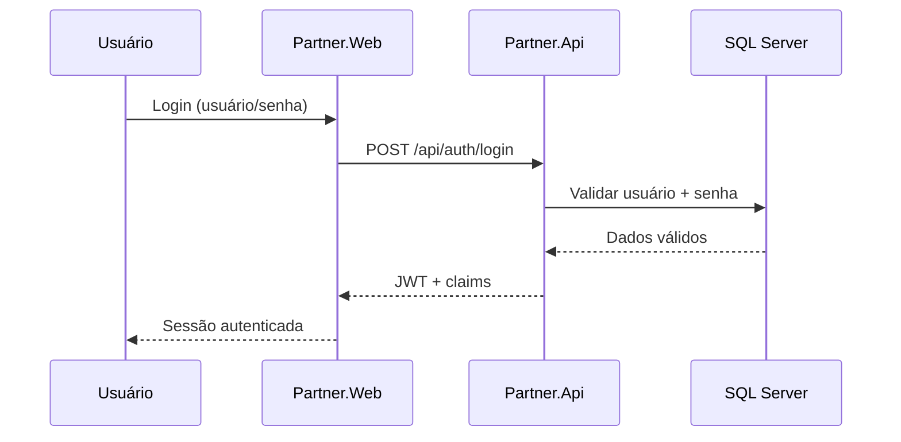
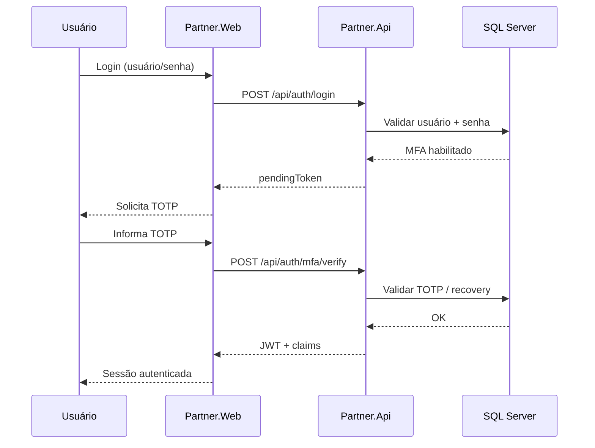
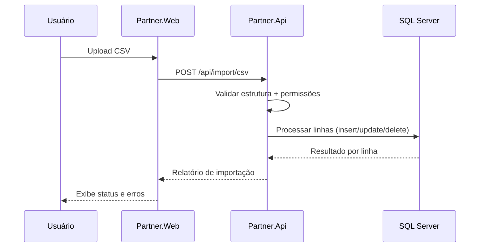
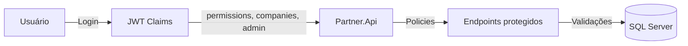

# Diagramas (Mermaid)

## Arquitetura geral
```mermaid
flowchart LR
    subgraph Frontend
        WEB[Partner.Web (Angular)]
    end

    subgraph Backend
        API[Partner.Api (.NET 8)]
        AUTH[Auth & MFA]
        USERS[Users]
        COMP[Companies]
        CLIENTS[Clients]
        IMPORT[Import CSV]
    end

    subgraph Infra
        DB[(SQL Server)]
        LOGS[Serilog Logs]
    end

    WEB --> API
    API --> AUTH
    API --> USERS
    API --> COMP
    API --> CLIENTS
    API --> IMPORT
    AUTH --> DB
    USERS --> DB
    COMP --> DB
    CLIENTS --> DB
    IMPORT --> DB
    API --> LOGS
```

## Login tradicional


## Login com MFA


## Fluxo de importação CSV


## Fluxo de permissões
